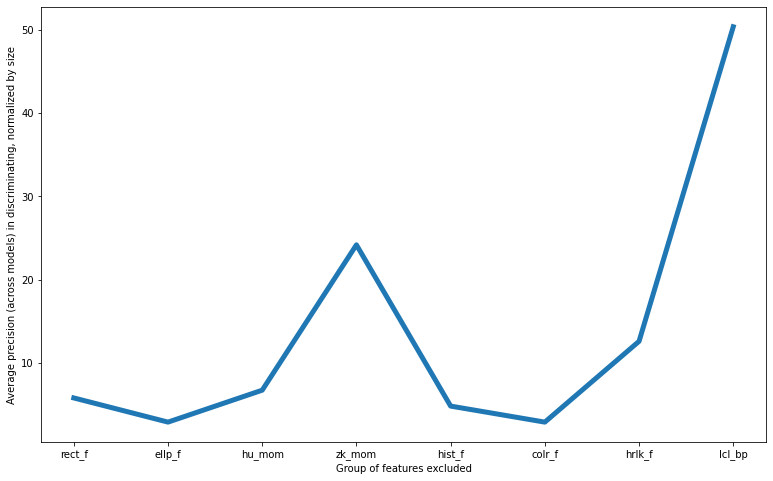

# Plankton Anomaly Detection
Starting from the [IBM lensless plankton dataset](https://ibm.ent.box.com/v/PlanktonData), I've designed 5 anomaly detection models to recognize 5 different species of plankton from the features extracted from their images. Such models (adding more for more species) can be used together to estimate water "health" and anomalies: if none of the models detects a species when some structure is under the lens of the microscope, it might be dead plankton (or an unseen species), suggesting problems in the water containing it.

## Features
I've selected many types of features (116 total) to deal with the variability of the species:
-   6 Minimum enclosing rectangle features
-   3 Minimum enclosing ellipse features
-   7 Hu moments
-   25 Zernike moments
-   5 Grayscale histogram features
-   3 Color ratios
-   13 Haralick/GSCM features
-   54 Local Binary Patterns
With such features, the species should be seperable and recognizable, as we can also see from the PCA analysis:

## Models
I've first tried a One-class SVM, but since it didn't give good results (even with cross validation), I've resorted to an **Isolation Forest**, that allowed me to get over 90% accuracy on positives and 100% on negatives.
## Feature selection
The features selected are quite extensive, so I've tried to see which ones proved to be the most critical in anomaly detection, measuring the performance when deleting that group of features. Averaging across models, the result is the following:

showing that local binary patterns are the most important (accuracy drops the most when removing them). Actually, when normalizing by feature group size (which for LBPs is the biggest, 54), we get this:

showing that ellipse and color features are the most important in realation to their number.
